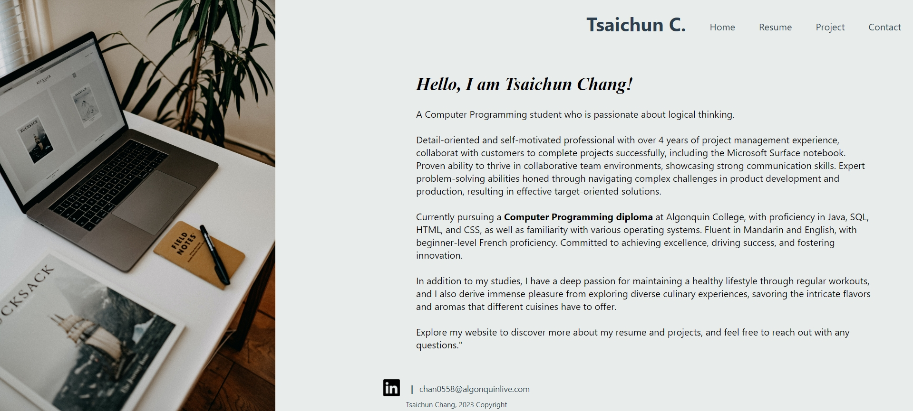
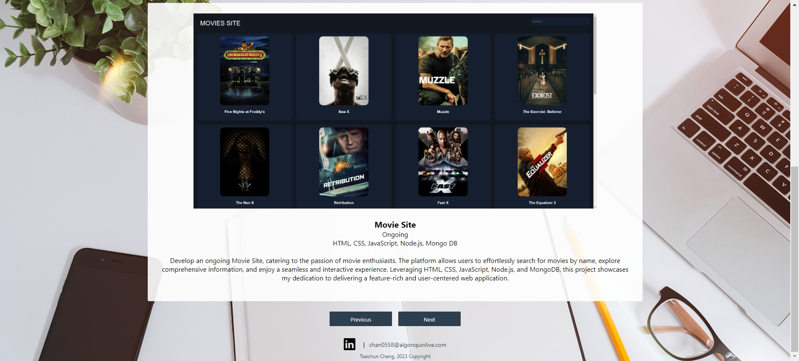
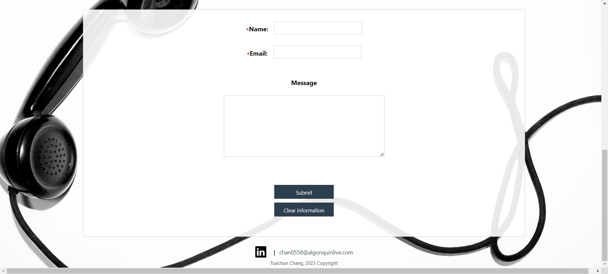

<h3>How does it work?</h3>

  • Enhanced accessibility by incorporating alt-text for images and semantic HTML, aligning with WCAG guidelines.  
  •	Used CSS media queries to create a responsive page.  
  •	Implemented JavaScript functionality to build project portfolio slides and enhance user interaction.  

 
<h3 align="left">How it looks like?</h3>

  Home Page 
  

 

  Resume 
  

 

  Project 
    
  

 

  Contact 
  

  
